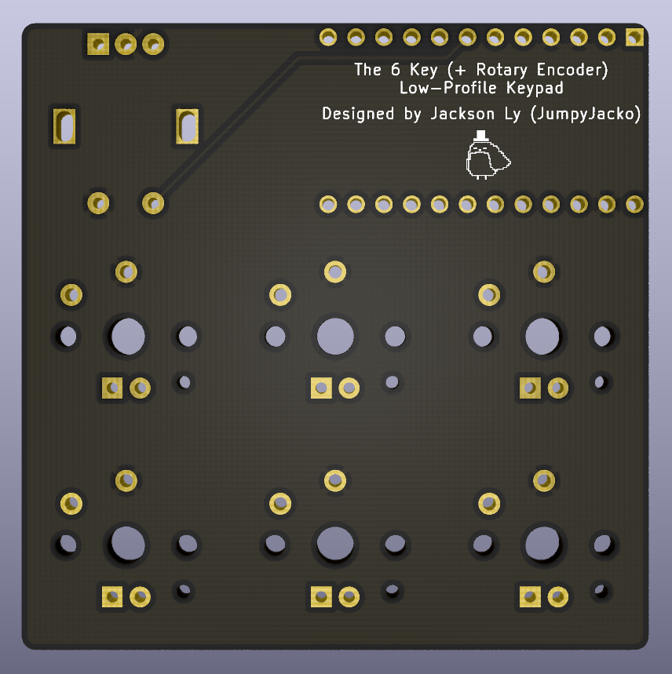
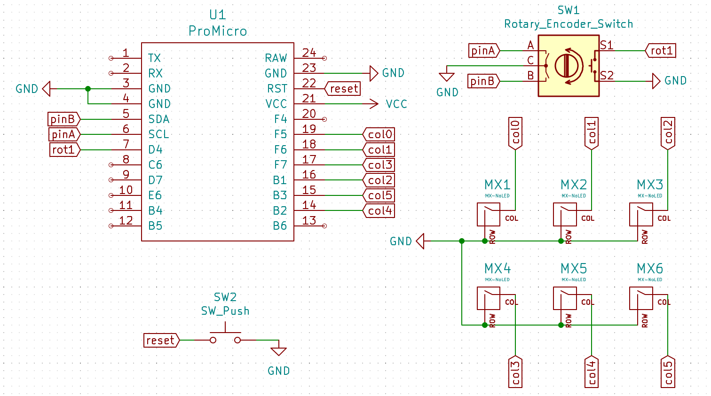

# A 6 Key (+ Rotary Encoder) Low-Profile Keypad
Designed by a person who doesn't know how to design a PCB (thanks aio3 for the guide and all the other resources I used).

Made because I had 6 keyswitches leftover and wanted to try my hand at designing a PCB.

# Gallery
### The PCB

### The Schematic

# Extras
Please tell me if I did something wrong, I'm honestly not too sure if any of this PCB is correct.